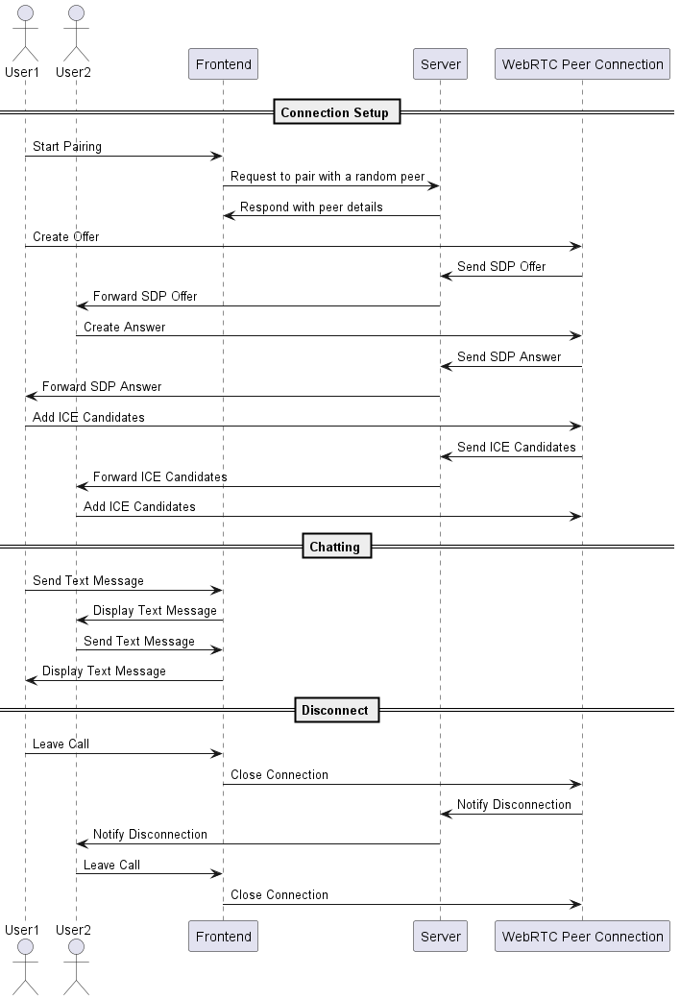

This is a simple chat application that uses WebRTC for peer-to-peer communication. Users can video chat and exchange messages with random peers.

### Features

- **Video Chat**: Real-time video communication between users.
- **Text Chat**: Send and receive text messages during video calls.
- **Peer Connection Management**: Automatic handling of SDP offers, answers, and ICE candidates.

### Architecture

Below is a simple depiction of how the app's flow.

### Description:
1. **Connection Setup**:
    - `User1` initiates pairing by sending a request to the `Frontend`.
    - The `Frontend` communicates with the `Server` to pair with a random peer.
    - The `Server` responds with peer details.
    - `User1` creates an SDP offer and sends it to the `Server`.
    - The `Server` forwards the SDP offer to `User2`.
    - `User2` creates an SDP answer and sends it back to the `Server`.
    - The `Server` forwards the SDP answer to `User1`.
    - Both users add ICE candidates through the `PeerConnection`, with candidates being exchanged via the `Server`.

2. **Chatting**:
    - Text messages are sent between `User1` and `User2`, displayed in their respective `Frontend`.

3. **Disconnect**:
    - Either user can leave the call, triggering the closure of the `PeerConnection` and notifying the other user through the `Server`.

 
 
